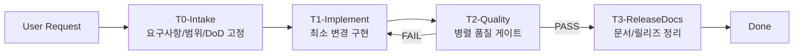
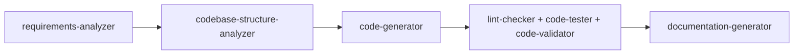
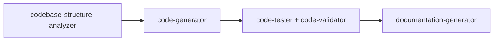
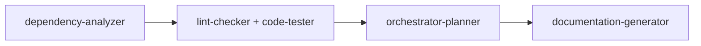

# Agent Workflow Visual Map

이 문서는 `AGENT_TEAMS.md`의 운영 규칙을 시각적으로 빠르게 확인하기 위한 다이어그램 뷰입니다.

## 1) Team 파이프라인 (기본)



## 2) Team-에이전트 매핑

```mermaid
flowchart TB
    subgraph T0[T0-Intake]
        RA[requirements-analyzer]
        CSA[codebase-structure-analyzer]
        OP0[orchestrator-planner]
    end

    subgraph T1[T1-Implement]
        CG[code-generator]
        ETI[external-tool-integrator]
    end

    subgraph T2[T2-Quality]
        LC[lint-checker]
        CV[code-validator]
        CT[code-tester]
        DA[dependency-analyzer]
    end

    subgraph T3[T3-ReleaseDocs]
        DG[documentation-generator]
        OP1[orchestrator-planner]
    end

    TO[token-optimizer<br/>(대규모 작업 사전 최적화)]
    TO --> T0
    T0 --> T1 --> T2 --> T3
```

## 3) 작업 유형별 흐름

### 기능 추가



### 버그 수정



### 배포 전 점검



## 4) Quality Gate 체크 지점

| Gate | 필수 Evidence 예시 |
|---|---|
| T0 완료 | Goal/Scope/Done/Risk/Evidence 5항목 |
| T2 완료 | `tsc`, `lint`, `build` 또는 Docker 스모크 로그 |
| T3 완료 | 변경 문서 1개 이상 + 롤백/우회 메모(운영 영향 시) |

## 5) 사용 방법

1. 작업 시작 전 `AGENT_TEAMS.md`와 함께 본 문서를 열어 흐름을 확인합니다.
2. 실패 루프가 발생하면 T2 결과를 근거로 T1로 되돌아가 최소 수정합니다.
3. 완료 보고 시 Handoff 템플릿 5항목을 팀 간 공통 포맷으로 전달합니다.
